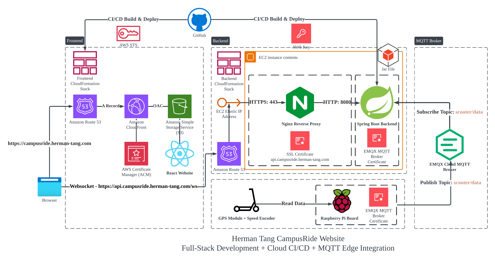
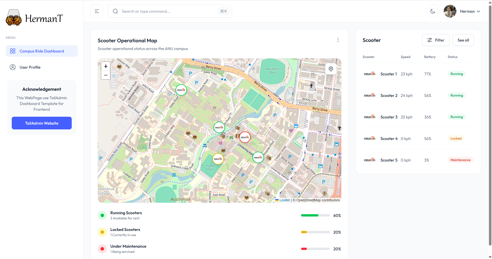

# CampusRide IoT Real-Time Visualization Dashboard

[CampusRide Website](https://campusride.herman-tang.com)

CampusRide is an IoT dashboard for real-time visualization of scooter operations. It retrieves scooter status — including location, speed, and battery level — and sends the data via a public MQTT broker to the Spring Boot backend. The frontend communicates with the backend over WebSocket, allowing the backend to push the latest data to the frontend and update the UI instantly.



## Overview

CampusRide delivers a fully functional dashboard for monitoring scooter status in real time. It is built on:

**Frontend**
- React 19
- TypeScript
- Tailwind CSS
- S3 + CloudFront (with ACM certificates)

**Backend**
- Spring Boot
- Nginx reverse proxy
- EMQX Cloud
- AWS EC2

**MQTT Broker**
- EMQX Cloud

**End Device**
- Raspberry Pi + GPS module + speed encoder



## Local Installation

### Prerequisites

Ensure the following are installed and set up:
- JDK 17
- Maven

**Start the Backend Server**
```bash
cd apps/backend/
mvn spring-boot:run
```
**Start the Frontend Server**
```bash
cd apps/frontend
yarn install
yarn dev
```

Configure your own certificate, username, and password for the EMQX MQTT Broker by setting the credential paths.

## EMQX Cloud MQTT Broker

Cost comparison for 10 messages per second, 24/7 for 30 days:

**AWS IoT Core**
- Messaging: $1 per 1M messages → 25.92M ≈ $25.92/month
- Connection minutes: 43,200 per device → ~$0.0035/month (negligible)
- Total: ~$25.92/month

**EMQX Cloud (Serverless Free Tier)**
- Session minutes: 43,200/month → within 1M free tier → $0
- Traffic: 1 KB/message → 24.7 GB/month
- Free tier includes 1 GB → ~23.7 GB extra
- Extra traffic cost: 23.7 × $0.15 ≈ $3.56/month
- Total: ~$3.56/month

Choice: EMQX Cloud is used for lower cost. Download the certificate from the EMQX portal and configure authentication and authorization.

## Deployment (Backend)

### 1. Base Infrastructure Deployment (Manual)

**Purpose:** Provision and configure the persistent backend resources.

**Steps:**
1. **Prepare Networking**
   - Create VPC and subnet.
   - Allocate an Elastic IP (EIP).

2. **Launch EC2 Instance**
   - Instance type: `t3.micro`
   - Place it in the target VPC/subnet.
   - Create and attach a security group.

3. **DNS Configuration**
   - Associate the EIP with the EC2 instance.
   - Create a Route 53 record mapping `campusride.herman-tang.com` to the EIP.

4. **Server Configuration (Manual)**
   - Securely copy SSL certificates to the EC2 instance.
   - Store AWS keys and EMQX MQTT credentials in GitHub for CI/CD workflows.
   - Set up Nginx with SSL for `api.campusride.herman-tang.com`.
   - Configure Nginx to forward HTTPS (443) requests to HTTP (8080) on the Spring Boot backend.

**CloudFormation Template:**  
`apps/infrastructure/infrastructure-backend.yml`

> This base infrastructure is deployed manually since it rarely changes.

---

### 2. Backend Application Deployment (CI/CD)

**Workflow:** `.github/workflows/deploy-backend.yml`  
**Trigger Conditions:**
- Push to `main` affecting files in `apps/backend/`

**Automated Process:**
1. Build the Spring Boot application.
2. Copy the generated JAR file to the EC2 instance.
3. Run the JAR as a system service to ensure it restarts automatically if the instance reboots.

---

## Deployment (Frontend)

The frontend is deployed via an automated CI/CD pipeline using GitHub Actions and CloudFormation.

---

### 1. CI Access with GitHub OIDC and AWS STS

**Purpose:** Securely provide AWS access to CI workflows without storing long-lived credentials.

**Implementation:**
- The pipeline uses **GitHub OpenID Connect (OIDC)** to obtain **temporary AWS credentials** from **AWS STS**.
- Permissions are restricted to the specific repository and branch.

**Benefits:**
- No AWS secrets stored in GitHub
- Short-lived, automatically expiring credentials
- Enforced least privilege through scoped trust policies

---

### 2. Frontend Infrastructure Deployment (CI/CD)

**Resources Provisioned:**
- **S3 Bucket** for hosting the Single Page Application (SPA)
- **CloudFront Distribution** with Route 53 DNS and ACM SSL certificate
- **WebSocket Route**: `api.campusride.herman-tang.com` → EC2 public IP → Nginx → Spring Boot backend

**CloudFormation Template:**  
`apps/infrastructure/infrastructure-frontend.yml`

**Workflow:** `.github/workflows/deploy-frontend.yml`  
**Triggers:**
- Push to `main` affecting files in `apps/frontend/`
- Push to `main` affecting `infrastructure-frontend.yml`
- Manual dispatch

---

### 3. Automated Deployment Process

1. Build the React frontend using `yarn build`
2. Deploy or update the `CampusRide-Frontend` CloudFormation stack
3. Upload the build artifacts to the S3 bucket
4. Invalidate the CloudFront cache to serve the latest files immediately

---

## Estimated Monthly Cost (Sydney, ap-southeast-2, 1 msg/sec)

**Assumptions**
- EMQX Cloud Serverless Free Tier (1M session minutes + 1 GB traffic free)
- One device connected continuously (~43,200 session minutes/month)
- Message size ≈ 1 KB
- EC2 t3.micro (On-Demand, ap-southeast-2)
- Elastic IP associated with a running EC2 instance (no additional cost)

**Monthly Usage**
- Messages: ~2,592,000/month (~2.47 GB traffic)
- EMQX: 1 GB free → 1.47 GB billable → 1.47 × $0.15 ≈ **$0.22**
- EC2 t3.micro: $0.0136/hr × 730 ≈ **$9.93**

**Total ≈ $10.15/month**

