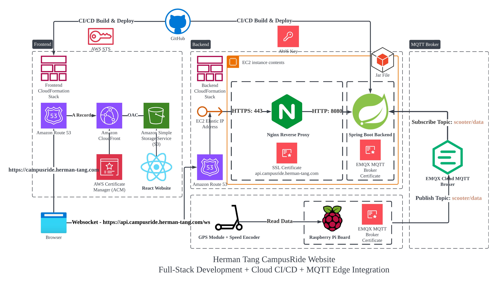

# ANU Graduation Requirement Checker Dashboard

[CampusRide Website](https://campusride.herman-tang.com)

CampusRide is an IoT Dashboard for real-time visualization of scooter management. It 



## Overview

GradTrack provides essential UI components and layouts for building feature-rich, data-driven admin dashboards and
control panels. It's built on:

Frontend
- React 19
- TypeScript
- Tailwind CSS
- S3 + Cloudfront (with ACM Certificates)

Backend
- Spring Boot
- Nginx Reverse Proxy
- EMQX Cloud
- AWS EC2

MQTT Broker
- EMQX Cloud

End Device
- Raspberry Pi + GPS Module + Speed Encoder


## Local Installation

### Prerequisites

To get started with frontend, ensure you have the following prerequisites installed and set up:

- JDK 17
- Maven

1. Start the Backend Server:

   ```bash
   cd apps/backend/
   mvn spring-boot:run
   ```

2. Start the Frontend Server:
   ```bash
   cd apps/frontend
   yarn install
   yarn dev
   ```

The current version required my own certificate and username and password for EMQX MQTT Broker, you need to configure the path for your own credentials.

## EMQX Cloud MQTT Broker


## 🚀 Deployment (Backend)

CampusRide uses **two separate CloudFormation stacks** for deployment:  

### Step 1 - Manually Configure VPC Subnet & Public IP

First on the AWS portal, I manually configure the VPC and subnet, and make sure their network ACL permit all the ports. Then, assign an elastic ip so that we have fixed ip address so frontend websocket can have a stable connection for backend server.

### Step 2 - Manually deploy Backend Cloudformation Stack
The backend deploys:
- Deploy EC2 Instance (t3.micro) in designated vpc and subnet
- Secutity Group
- Associate the Elastic IP to EC2 Instance
- Configure Route 53 record that point campusride.herman-tang.com to the Elastic IP

Because the backend infrastructure (EC2 + Route 53) will not change, I manually deploy the stack on AWS portal.

The CloudFormation template is:  
- apps/infrastructure/infrastructure.yml

Deployment is automated via GitHub Actions:  
- Workflow: **`.github/workflows/deploy-backend.yml`**
- Trigger:  
  - Push changes to `main` affecting `apps/backend/` or `infrastructure-backend.yml`
  - Manual dispatch

**What it does:**  
1. Deploys/updates CloudFormation stack `CampusRide-Backend`

### Step 3 - Prepare credentials and Nginx Reverse proxy for backend
scp the certificate file to EC2 instance and store the aws key and MQTT username and password in github repo secret store.
Then configure the nginx reverse proxy that accept https 443 websocket from frontend and redirect to http 8080 for spring boot backend

### Step 4 - CI/CD flow for backend
automte the maven build and copy the built jar to backend

## Frontend

### Step 3 - CI/CD flow Cloudformation Stack - Frontend
The frontend deploys:
- S3 bucket (hosting the SPA)  
- CloudFront distribution (with Route53 and ACM SSL cert)  
- Websocket connection -> campusride.herman-tang.com (Route 53 Record) -> EC2 Public IP -> EC2 Nginx Reverse Proxy -> EC2 Sprint Boot Backend

The CloudFormation template is:  
- apps/infrastructure/infrastructure-frontend.yml

Deployment is automated via GitHub Actions:  
- Workflow: **`.github/workflows/deploy-frontend.yml`**
- Trigger:  
  - Push changes to `main` affecting `apps/frontend/` or `infrastructure-frontend.yml`
  - Manual dispatch

**What it does:**  
1. Builds React frontend using `yarn build`  
2. Deploys/updates CloudFormation stack `CampusRide-Frontend`  
3. Uploads built files to the S3 bucket  
4. Invalidates CloudFront cache to serve new files immediately  

### 3️⃣ API URL (Frontend ↔ Backend)
- Frontend code uses `VITE_API_URL` environment variable  
- During production build, it’s overridden to `""` so CloudFront automatically forwards API requests to the backend


## 🔐 CI access with GitHub OIDC + AWS STS (no long‑lived secrets)

This repository uses **GitHub OpenID Connect (OIDC)** to let workflows obtain **temporary AWS credentials** from **AWS STS**.  
Benefits:
- **No stored AWS secrets** in GitHub  
- **Short‑lived** credentials (automatically expire)  
- Trust restricted to specific **repository** and **branch** (least privilege)

### How it works (high level)
1. The workflow requests an **OIDC token** from GitHub for the job (`permissions: id-token: write`).  
2. The action `aws-actions/configure-aws-credentials@v4` sends that token to **AWS STS** with **AssumeRoleWithWebIdentity**.  
3. STS returns **temporary credentials** for the IAM role that trusts the GitHub OIDC provider.  
4. Subsequent AWS CLI/SDK calls in the job use those temporary creds.

## MQTT Broker Handling

This 
  